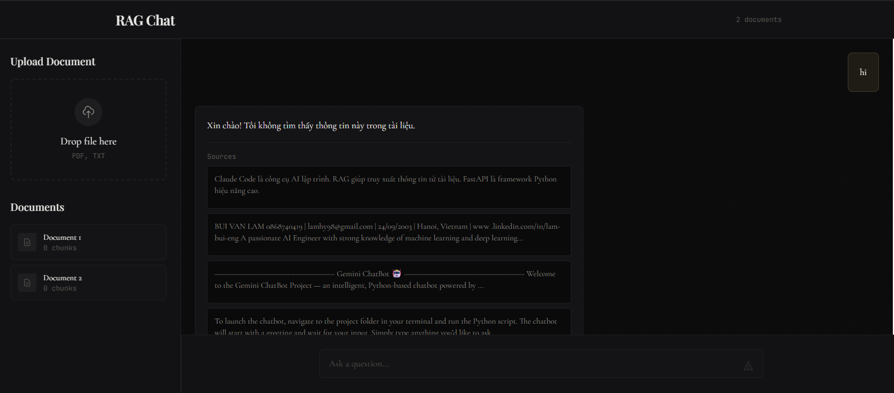
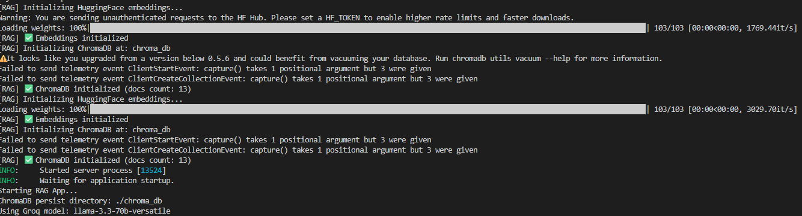

# RAG App - Ứng Dụng Nghiên Cứu Tài Liệu Thông Minh

Ứng dụng full-stack hoàn chỉnh cho phép người dùng tải lên tài liệu (PDF, Text) và đặt câu hỏi dựa trên nội dung tài liệu sử dụng công nghệ **RAG (Retrieval-Augmented Generation)**.


*Giao diện chính của ứng dụng - Nơi người dùng tương tác và đặt câu hỏi.*

## Giới thiệu
RAG App là một công cụ hỗ trợ nghiên cứu tài liệu thông minh. Bằng cách kết hợp sức mạnh của các mô hình ngôn ngữ lớn (LLM) và cơ sở dữ liệu vector, ứng dụng cho phép bạn "trò chuyện" với tài liệu của mình, nhận được các câu trả lời chính xác cùng với trích dẫn nguồn cụ thể.


*Quy trình cấu hình và tải tài liệu lên hệ thống.*

**Tính năng chính:**
- **Xử lý tài liệu thông minh:** Tải lên và tự động trích xuất nội dung từ các tệp PDF và Text.
- **Hệ thống RAG mạnh mẽ:** Sử dụng ChromaDB để lưu trữ vector và tìm kiếm thông tin liên quan nhất.
- **Câu trả lời chính xác:** Tích hợp mô hình Llama 3 qua Groq Cloud để phản hồi nhanh và chính xác.
- **Trích dẫn nguồn:** Mỗi câu trả lời đều đi kèm với các đoạn trích từ tài liệu gốc để kiểm chứng.
- **Giao diện hiện đại:** Xây dựng với React và Tailwind CSS, mang lại trải nghiệm người dùng mượt mà.

## Hướng Dẫn Cài Đặt

### 1. Thiết Lập Môi Trường

```bash
# Tạo môi trường ảo
python -m venv venv

# Kích hoạt môi trường ảo
# Windows:
venv\Scripts\activate
# Linux/Mac:
source venv/bin/activate

# Cài đặt các gói phụ thuộc
pip install -r requirements.txt
```

### 2. Cấu Hình Biến Môi Trường

Tạo tệp `.env` trong thư mục gốc (hoặc trong thư mục `backend` tùy theo cấu trúc chạy):

```bash
GROQ_API_KEY=your_groq_api_key_here
GROQ_MODEL=llama-3.3-70b-versatile
CHROMA_PERSIST_DIRECTORY=./chroma_db
```

### 3. Chạy Ứng Dụng

#### Chạy Backend:
```bash
cd backend
uvicorn main:app --reload --port 8001
```

#### Chạy Frontend:
```bash
cd frontend
npm install
npm run dev
```

Máy chủ backend: http://localhost:8001  
Ứng dụng frontend: http://localhost:5173

## Công Nghệ Sử Dụng

- **Backend:** Python, FastAPI
- **AI Framework:** LangChain
- **Vector Database:** ChromaDB (local)
- **Embeddings:** HuggingFace (sentence-transformers/all-MiniLM-L6-v2)
- **LLM:** Groq Cloud (Llama 3.3 70B)
- **Frontend:** React (Vite) + Tailwind CSS

## Đóng Góp

Đây là một dự án cá nhân. Hãy tự do fork và thử nghiệm!

## Giấy Phép

MIT
